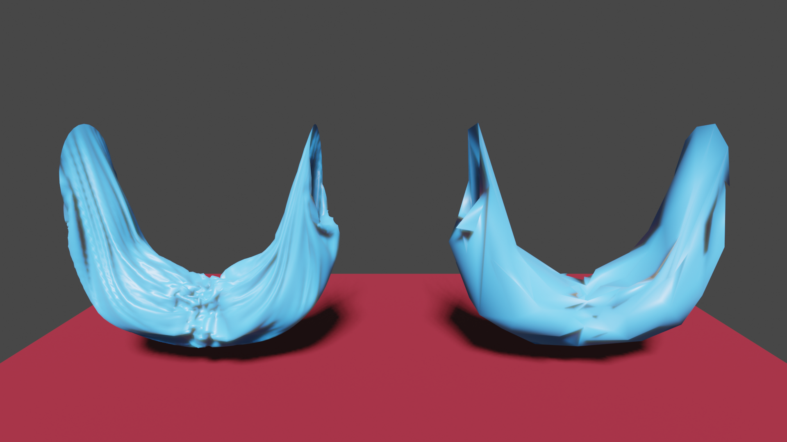
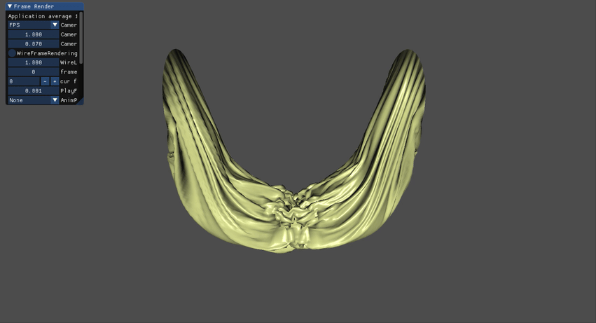

# Mesh Optimization





My copy of Mesh optimization (Siggraph 1993) by [Hoppe](https://hhoppe.com/) et al. I copied [his code](https://github.com/hhoppe/Mesh-processing-library/blob/main/Meshfit/Meshfit.cpp) and make it work on my code base. As a project submission of my master's degree class, COMP 6381 (Geometric Modelling), I wrote this code to understand his paper and try applying non-linear solvers for the first stage of the paper's algorithm (using [AMPL](https://ampl.com/)), where you fit mesh vertices into the randomly sampled points. In the original paper, they just solved the linear least-squares problem locally because their simplification operation works on one vertex at a time. However, the application with non-linear solvers didn't make any noticeable difference for my optimization results. Therefore, I just submitted this implementation to the class submission. This paper is very educational for studying the practical application of linear least-squares problem and learning topological operations such as edge collapse, edge split, and edge swap with HalfEdge data structure of a mesh.

I add my documents on [docs](docs) folder. There are "Project Report", My analysis for linear least squares problem, and presentation ppt pdfs in the folder.


# How to Build (tested only on Windows)

I am using CMake to build a Visual Studio Project for this.

On this repository, create a build folder and then move to the build folder:

```
mkdir build
cd build
```

Type a CMake command to create a Visual Studio project

```
cmake ../ -G "Visual Studio 17 2022" -A x64
```

Now you can see `MeshOptimization.sln` file. 


# How to use this application

The application takes two arguments. The first one is a path of an obj file and the second one is the shape index of the obj file. I added my test obj file `cylindrical_cloth227.obj` on `resource` folder. The shape index to optimize for the obj file is 1. Move this file next to the executable file. Then, you can execute the application with this command

```
MeshOptimization.exe cylindrical_cloth227.obj 1
```

The program will optimize the mesh and create a directory for the result. The application currently exports the intermediate results together by the boolean flag at `mesh_optimize` function on `meshopt.cpp`. You can set `constexpr bool EXPORT_INTERMEDIATE_OBJ` as false in the function if you don't want to export the intermediate ones.

I attach a result folder `Opt2024_11_22_12_0_39` as an example in the `resource` folder.


# AMPL

I used AMPL to apply non-linear solvers for the linear equations. Even though applying the solver for global fitting didn't make big difference for the result, I added my codes that uses and tests the AMPL code. You can activate it by changing `USE_AMPL_SOLVER` into `TRUE` in the `CMakeLists.txt`. I only used it on Windows platform. So If you want to use it, you have to figure out how to configure the AMPL on different platforms. I also added the lib/dll for AMPL. In additon to this, as far as I know, you also need to login on your computer to use the AMPL library.


# Python Codes

I used python codes for visualizations to check whether my mesh operations work well or not, including the intermediate results in the mesh optimization process. I wrote the test codes on `mesh_test.cpp` and the codes export the .obj files for some operations. Then you can use `python/mesh_operation_render.py` to render the result and save it into a png file. You have to specify the directory that you will import the test obj files from. You can use `environment.yml` in order to create your python conda environment.

`python/meshopt_port.py` supports rendering original mesh, intermediate meshes, and final optimized meshes at the same time to compare the results. Make sure that you also need to specify the path for the result directory.


# Reference

* Hoppe, H., DeRose, T., Duchamp, T., McDonald, J. and Stuetzle, W., 1993, September. Mesh optimization. In *Proceedings of the 20th annual conference on Computer graphics and interactive techniques* (pp. 19-26).
* Botsch M. Polygon Mesh Processing. Natick, Mass.: A K Peters; 2010
* [Dr. Hugues Hoppe's mesh processing library](https://github.com/hhoppe/Mesh-processing-library/tree/main)
* Geometry algorithms from Real-Time Collision Detection by Christer Ericson.
* AABB tree construction from [godot](https://github.com/godotengine/godot).
* [tinyobjloader](https://github.com/tinyobjloader/tinyobjloader)
* [AMPL](https://ampl.com/)


